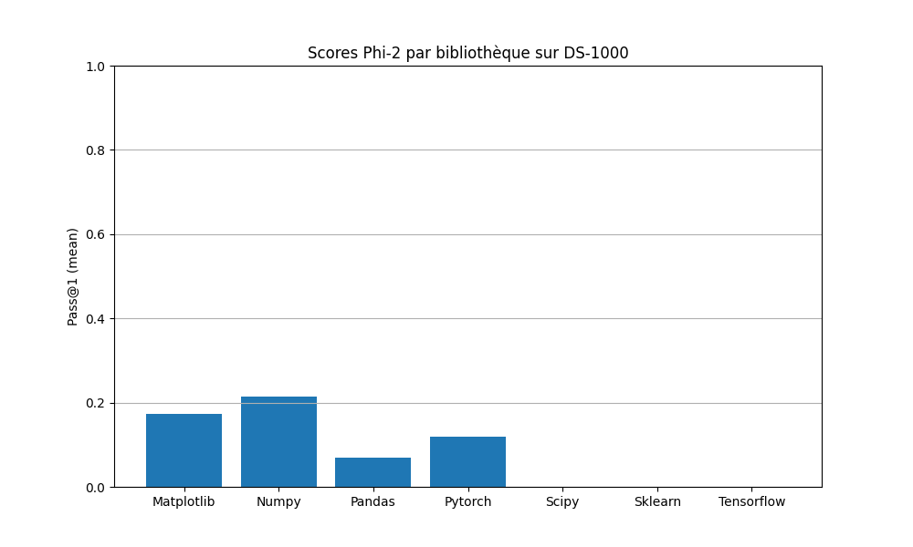
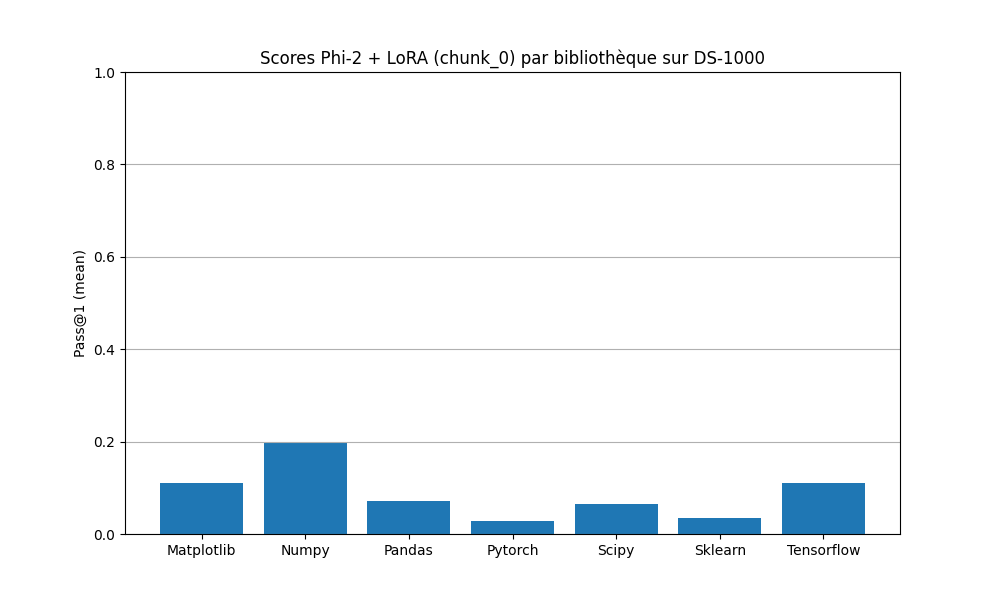

# Fine-Tuning de Phi-2 pour la Data Science (Pandas & Matplotlib)

Ce projet de recherche et développement explore l'adaptation d'un Modèle de Langage de Grande Taille (LLM) dans un environnement matériel contraint. L'objectif technique est d'implémenter un pipeline complet de *Parameter-Efficient Fine-Tuning* (PEFT) sur le modèle Microsoft Phi-2 (2.7B), ciblant spécifiquement la génération de code Python avec les bibliothèques `pandas` et `matplotlib`.

## Architecture et Paramètres Techniques
* **Modèle de base :** `microsoft/phi-2` (chargé en `float16`)
* **Méthode d'adaptation :** LoRA (Low-Rank Adaptation) avec un rang $r=16$ et $\alpha=32$.
* **Corpus d'entraînement :** Sous-ensemble filtré de [The Stack Dedup](https://huggingface.co/datasets/bigcode/the-stack-dedup) (isolation stricte des scripts contenant `import pandas` ou `import matplotlib`).
* **Optimisation VRAM :** Utilisation de l'optimiseur `paged_adamw_32bit` et accumulation de gradients (Batch effectif de 16) pour pallier les limitations matérielles initiales.

## Structure du Dépôt
L'architecture sépare strictement la configuration, l'ingénierie des données et les scripts d'entraînement.

```bash
./
├── README.md
├── configs/              # Fichiers de configuration (ex: train_config.yaml)
├── notebooks/            # Exploration des données et prototypage
├── src/                  # Code source modulaire
│   ├── filter_dataset.py # Pipeline d'extraction depuis The Stack
│   ├── train.py          # Script d'entraînement LoRA
│   ├── benchmark.py      # Évaluation sur DS-1000
│   └── utils/            # Dépendances d'exécution isolée
└── requirements.txt
```

## Installation et Utilisation
```bash
git clone <repo>
cd <repo>
pip install -r requirements.txt
```
### 1. Préparation des données
Extraction des scripts Python pertinents depuis The Stack :
```bash
python src/filter_dataset.py
```
### 2. Entraînement (Fine-Tuning LoRA)
L'entraînement est paramétré via le fichier configs/train_config.yaml.
```bash
python src/train.py
```
### 3. Évaluation (DS-1000)
Génération et validation automatique des réponses sur le benchmark scientifique :
```bash
python src/benchmark.py
```

## Évaluation et Analyse Critique (Distribution Shift)
Les performances ont été mesurées via la métrique Pass@1 sur le benchmark DS-1000.
| Modèle | Pass@1 moyen (%) |
| :--- | :---: |
| **GPT-4-turbo** | 53.9 |
| **GPT-3.5-turbo (0125)** | 39.4 |
| **GPT-3.5-turbo (0613)** | 38.6 |
| Phi-2 fine-tuné (chunk0) | 10.2 |
| Mistral 7B | 10.1 |
| Phi-2 base | 10.0 |




### Analyse des résultats :
Le fine-tuning ciblé a permis l'émergence de capacités non nulles sur des bibliothèques tierces (Scipy, Sklearn), mais le score global stagne par rapport au modèle de base (10.2% vs 10.0%).

Cette stagnation s'explique par un biais d'alignement majeur (Distribution Shift) entre la phase d'apprentissage et l'évaluation :
    **1. L'entraînement (Causal LM) :** Le modèle a ingéré du code source brut. Ses poids ont été ajustés pour la prédiction stricte du token suivant (auto-complétion de scripts).
    **2. L'évaluation (Instruction-following) :** DS-1000 interroge les modèles à l'aide d'instructions complexes en langage naturel (ex: "Write a python function to...").
Le modèle n'ayant bénéficié d'aucune phase d'Instruction Tuning, la dégradation de certaines métriques spécifiques (comme la baisse sur *matplotlib*) illustre une rupture de distribution plutôt qu'une régression syntaxique : le modèle échoue à interpréter la structure de la requête, masquant ainsi ses réelles capacités de génération de code.

## Modèle et Poids
Afin d'assurer la reproductibilité tout en allégeant ce dépôt, les adaptateurs LoRA générés sont hébergés séparément.
Vous pouvez retrouver les poids finaux et le script d'inférence (adapté pour la complétion causale) sur Hugging Face : https://huggingface.co/jhondoe789/projet_cmi_L2_phi-2_lora .